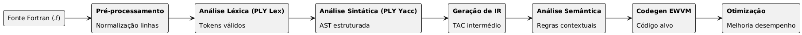

# Compilador Fortran 77

**Processamento de Linguagens - G37**

Ana Beatriz Freitas a106853 | Luis Miguel Coelho 106843 | Matilde Teixeira xxxxx
**Instituição:** Universidade do Minho
**Ano letivo:** 2026

---

## 1. Introdução

O presente relatório descreve o desenvolvimento de um compilador para um subconjunto de Fortran 77. A implementação foi realizada em Python, recorrendo à biblioteca PLY para as fases de análise léxica e sintática, e foi estruturada de forma modular para permitir evolução progressiva até à geração de código para EWVM. Desde o início, a prioridade foi obter uma solução tecnicamente sólida e de leitura imediata, com separação de responsabilidades entre fases e validação contínua através de testes automatizados.

Do ponto de vista metodológico, o trabalho seguiu o encadeamento clássico de compiladores: tokenização, parsing e construção de AST, seguido de tradução para representação intermédia. As fases de análise semântica, codegen para EWVM e otimização ficaram previstas no desenho, mas ainda não estão concluídas nesta versão. **ALTERAR DEPOIS**

## 2. Arquitetura global

A arquitetura adotada baseia-se numa *pipeline* explícita em que cada etapa recebe uma representação bem definida e produz a representação seguinte. O código fonte Fortran é inicialmente transformado em linhas lógicas, depois convertido em tokens, validado sintaticamente para construção da AST e, por fim, traduzido para IR de três endereços. Esta abordagem foi escolhida por razões de clareza e manutenção uma vez que permite testar cada fase de forma isolada, reduzir acoplamento entre componentes e localizar erros com maior precisão.

A organização dos módulos reflete essa decisão. A pasta `src/analise_lexica` concentra pré-processamento e lexer, a PA `src/analise_sintatica` contém parser e nós da AST, a `src/representacao_intermedia` define o modelo de instruções e o gerador AST→IR. A interface de execução foi centralizada em `src/cli.py`, enquanto o tratamento de erros está em `src/errors.py`, garantindo mensagens consistentes ao longo de todo o pipeline.

Para enquadrar visualmente esta arquitetura, o diagrama seguinte apresenta a progressão completa do compilador, da entrada fonte até às fases finais de geração e otimização:



No esquema, a fase de pré-processamento normaliza o formato do programa e resolve elementos estruturais de linha que influenciam diretamente o reconhecimento léxico. De seguida, a análise léxica com PLY Lex converte a entrada em tokens válidos para consumo do parser. A análise sintática com PLY Yacc valida a estrutura gramatical e produz a AST, que funciona como representação estruturada do programa. A partir dessa árvore, o gerador de IR constrói uma forma intermédia de três endereços, adequada para transformação de controlo de fluxo e preparação de backend. Por fim, o diagrama inclui também as fases de análise semântica, geração de código EWVM e otimização, mantendo desde já explícita a organização final do relatório e da solução completa.

## 3. Análise léxica

A fase léxica revelou, desde cedo, um ponto crítico típico de Fortran 77, isto é, a coexistência entre formato *fixed-form* e *free-form*. Em vez de sobrecarregar o *lexer* com lógica de colunas e concatenação de linhas, foi criado um pré-processador dedicado que transforma linhas físicas em linhas lógicas. Essa escolha simplificou significativamente a tokenização e tornou o comportamento mais previsível.

No modo fixed-form, o pré-processamento interpreta comentários em coluna inicial, extrai labels numéricos nas colunas 1–5, deteta continuação na coluna 6 e considera código útil nas colunas 7–72, com tolerância para casos não estritamente alinhados ao padrão. No modo free-form, trata comentários inline com `!` e continuação por `&`. A saída deste passo é uma sequência de objetos lógicos com texto de código, número de linha base e label opcional.

O lexer PLY reconhece palavras-chave essenciais da linguagem, identificadores, literais numéricos e lógicos, strings, operadores aritméticos/relacionais/lógicos e pontuação sintática. Como Fortran é case-insensitive, a implementação normaliza lexemas para maiúsculas e usa `re.IGNORECASE`, o que garante robustez sem aumentar complexidade gramatical. Os erros léxicos são reportados com localização através da hierarquia de exceções do projeto.

Como exemplo concreto do comportamento implementado, o estágio léxico processa corretamente padrões clássicos de Fortran 77, incluindo labels, operadores e strings. Um exemplo mínimo de entrada é:

```fortran
PROGRAM HELLO
    PRINT *, 'Ola, Mundo!'
    END
```

e o resultado observado no estágio `lex` inclui, entre outros, os tokens `PROGRAM`, `ID`, `PRINT`, `STRING_LIT` e `END`.

## 4. Análise sintática e AST

Para parsing foi usado `ply.yacc` com estratégia LALR(1), opção alinhada com o enunciado e adequada ao tipo de gramática tratado. A gramática implementada cobre os elementos exigidos para a fase atual: estrutura de programa, declarações de tipo, atribuições, expressões com precedência, decisões condicionais (`IF`, `ELSEIF`, `ELSE`, `ENDIF`), `IF` aritmético, ciclo `DO` clássico com label, saltos (`GOTO`), controlo (`CONTINUE`, `STOP`, `RETURN`), chamadas (`CALL`) e operações de entrada/saída (`READ`, `PRINT`, `WRITE`).

A tabela de precedências e associatividades foi definida explicitamente para resolver ambiguidades e preservar a interpretação esperada de expressões, incluindo operadores unários e exponenciação associativa à direita. Esta decisão evitou conflitos de parsing e manteve a gramática legível.

A AST foi modelada com `dataclasses`, permitindo uma representação tipada e clara dos nós de programa, declarações, instruções e expressões. Um aspeto importante desta fase foi preservar labels de origem em instruções labeladas, dado que tal informação é necessária na tradução de controlo de fluxo. A distinção entre chamada de função e acesso a array em formas como `ID(...)` foi deixada para resolução semântica, por se tratar de ambiguidade contextual e não sintática.

## 5. Representação intermédia (AST → IR)

A tradução para IR foi implementada com uma representação de três endereços (TAC), composta por temporários, labels e instruções tipadas. A escolha desta IR, em vez de geração direta para uma VM de stack, foi deliberada: favorece compreensão, facilita depuração e abre espaço para otimizações antes do backend final.

O gerador IR segue o padrão Visitor, com um método por tipo de nó AST. A tradução cobre atribuições, operações unárias e binárias, saltos condicionais e incondicionais, controlo de fluxo para `IF` e `IF` aritmético, tratamento do `DO` clássico com fecho em `CONTINUE`, chamadas, I/O e acesso a arrays. Para manter consistência interna, operadores Fortran pontuados são normalizados para uma forma uniforme na IR.

Este desenho tornou possível validar o comportamento do frontend sem dependência do backend EWVM, reduzindo o risco de erro acumulado entre fases ainda em desenvolvimento.

Do ponto de vista de observabilidade, a IR já permite inspecionar diretamente o controlo de fluxo gerado. Um excerto representativo tem a forma:

```text
t1 = N <= 0
IF t1 GOTO THEN1 ELSE GOTO ENDIF1
THEN1:
PRINT '...'
ENDIF1:
```

Este tipo de saída facilita validação de precedências, saltos e estruturação de blocos antes da fase de backend.

## 6. Análise semântica (secção reservada)

*Secção intencionalmente reservada para a versão final do relatório.*
*A preencher após implementação completa de tabela de símbolos, verificação de tipos e validação contextual.*

## 7. Geração de código EWVM (secção reservada)

*Secção intencionalmente reservada para a versão final do relatório.*
*A preencher após implementação do backend IR→EWVM e definição do modelo de memória.*

## 8. Otimização sobre IR (secção reservada)

*Secção intencionalmente reservada para a versão final do relatório.*
*A preencher após implementação dos passes de otimização e respetiva avaliação de impacto.*

## 9. Validação end-to-end em EWVM (secção reservada)

*Secção intencionalmente reservada para a versão final do relatório.*
*A preencher após integração completa de execução em VM e comparação automática de outputs esperados.*

## 10. Tratamento de erros e robustez

O projeto utiliza uma hierarquia comum de exceções (`CompileError`, `LexError`, `ParseError` e `SemanticError`) associada a `SourceLocation`. Na prática, isto significa que erros são comunicados de forma coerente entre fases, no formato esperado de compilador, com indicação de ficheiro, linha e coluna. A uniformização deste mecanismo foi essencial para acelerar depuração durante evolução da gramática e da geração de IR.

## 11. Validação experimental

A validação foi conduzida com `pytest`, privilegiando testes por fase e casos de integração com programas de referência. No estado atual, a suíte contém 125 testes e todos se encontram a passar. A distribuição inclui testes de lexer, parser e IR, cobrindo casos normais, precedência de operadores, labels, fluxos com `DO`/`GOTO`, e compatibilidade fixed/free-form.

As fixtures `hello.f`, `fatorial.f`, `primo.f` e `continuation.f` foram selecionadas por representarem padrões diretamente alinhados com o enunciado: I/O básica, ciclos com labels, expressões lógicas e continuação de linha. Esta seleção permitiu validar não apenas unidades isoladas, mas também comportamento integrado do pipeline implementado.

Em termos quantitativos, o estado de testes implementados pode ser resumido da seguinte forma:

| Componente      | Ficheiro de testes             | Resultado atual   |
| --------------- | ------------------------------ | ----------------- |
| Léxico         | `tests/test_lexer.py`        | 98/98             |
| Sintático      | `tests/test_parser_smoke.py` | 20/20             |
| IR              | `tests/test_ir.py`           | 7/7               |
| **Total** | —                             | **125/125** |

## 12. Dificuldades encontradas e decisões de projeto

A principal dificuldade técnica foi lidar com especificidades históricas de Fortran 77, sobretudo no tratamento de colunas em fixed-form e no controlo de fluxo baseado em labels. A decisão de introduzir pré-processamento separado resolveu a primeira dificuldade de forma limpa. Já para a segunda, a estratégia de preservar labels na AST e traduzi-las explicitamente na IR permitiu manter rastreabilidade e correção estrutural no fluxo de execução.

Outra dificuldade relevante foi equilibrar simplicidade com extensibilidade. Evitou-se sobrecarga prematura com mecanismos semânticos incompletos ou otimizações ad hoc. Em vez disso, consolidou-se primeiro uma base funcional robusta, com testes e interfaces claras entre fases. Este encadeamento foi determinante para manter evolução controlada do projeto.

## 13. Execução e reprodução

Para reproduzir o estado atual, deve ser criado um ambiente virtual Python, instaladas as dependências e executados os estágios através da CLI. A sequência típica consiste em correr análise léxica, análise sintática e geração de IR sobre as fixtures incluídas, seguida da suíte de testes completa. Os comandos detalhados de instalação e execução estão documentados em [README.md](README.md).

## 14. Trabalho futuro

## 15. Conclusão

O trabalho realizado até ao momento apresenta uma base técnica sólida, coerente com os princípios de Processamento de Linguagens e adequada ao contexto pedagógico do projeto. O frontend está completo e estabilizado, a IR encontra-se funcional, e a validação automatizada confirma consistência interna da implementação. O desenho modular adotado facilita a continuação para semântica e geração de código, sem necessidade de reestruturações profundas.

Em síntese, o projeto encontra-se numa fase madura de desenvolvimento intermédio: já demonstra comportamento compilatório correto nas fases implementadas e está tecnicamente preparado para evoluir até à execução final em EWVM.

---

### Anexo — Gramática resumida do subconjunto implementado

```ebnf
program      ::= PROGRAM ID body END
body         ::= decl_list stmt_list

decl_list    ::= { decl }
decl         ::= INTEGER var_decl_list
               | REAL var_decl_list
               | LOGICAL var_decl_list
               | CHARACTER var_decl_list
               | DOUBLE PRECISION var_decl_list

var_decl_list ::= var_decl { ',' var_decl }
var_decl      ::= ID | ID '(' dim_list ')'
dim_list      ::= expr { ',' expr }

stmt_list    ::= { stmt }
stmt         ::= [LABEL] unlabeled_stmt

unlabeled_stmt ::= assign_stmt
                 | if_stmt
                 | do_stmt
                 | goto_stmt
                 | continue_stmt
                 | print_stmt
                 | read_stmt
                 | write_stmt
                 | stop_stmt
                 | return_stmt
                 | call_stmt

assign_stmt  ::= ID '=' expr
               | ID '(' arg_list ')' '=' expr

if_stmt      ::= IF '(' expr ')' THEN stmt_list elseif_chain ENDIF
               | IF '(' expr ')' int ',' int ',' int

elseif_chain ::= { ELSEIF '(' expr ')' THEN stmt_list } [ELSE stmt_list]

do_stmt      ::= DO int ID '=' expr ',' expr [',' expr]
goto_stmt    ::= GOTO int
continue_stmt::= CONTINUE
stop_stmt    ::= STOP
return_stmt  ::= RETURN

print_stmt   ::= PRINT '*' ',' print_list
read_stmt    ::= READ '*' ',' var_list
               | READ '(' expr ',' expr ')' var_list
               | READ '(' expr ',' '*' ')' var_list

write_stmt   ::= WRITE '(' expr ',' '*' ')' print_list
               | WRITE '(' expr ',' expr ')' print_list

call_stmt    ::= CALL ID [ '(' arg_list ')' ]

arg_list     ::= expr { ',' expr }
var_list     ::= lvalue { ',' lvalue }
lvalue       ::= ID | ID '(' arg_list ')'

expr         ::= literals
               | ID
               | ID '(' arg_list ')'
               | '(' expr ')'
               | unary expr
               | expr binary expr
```
